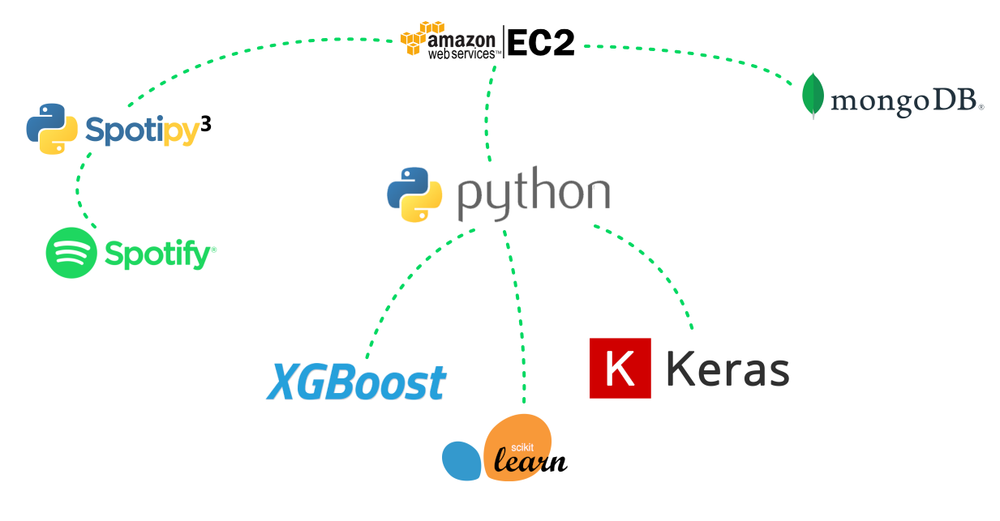
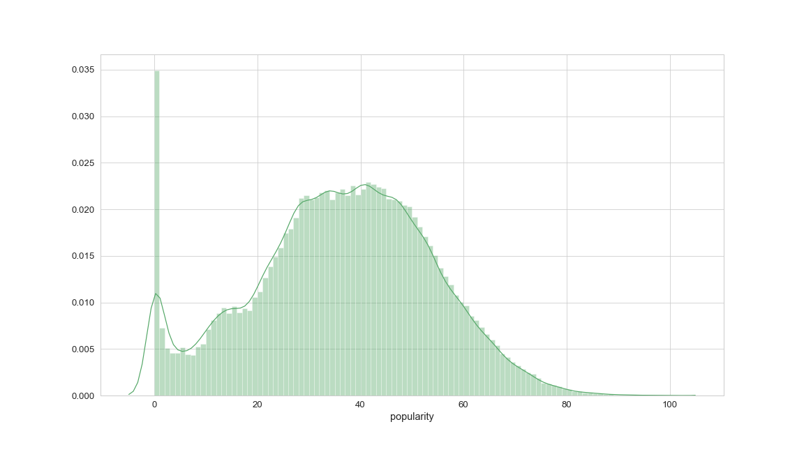
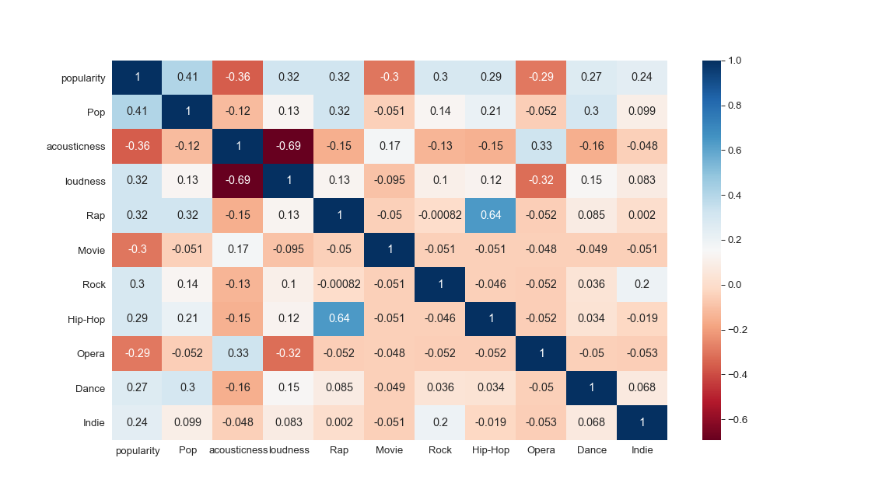
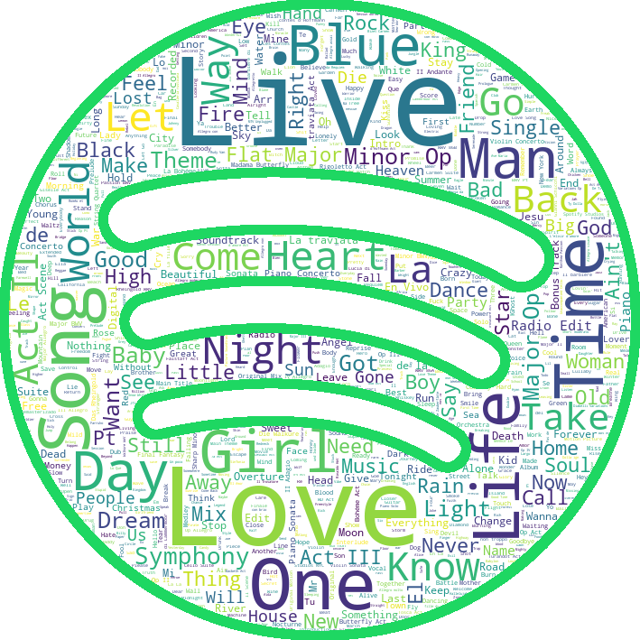
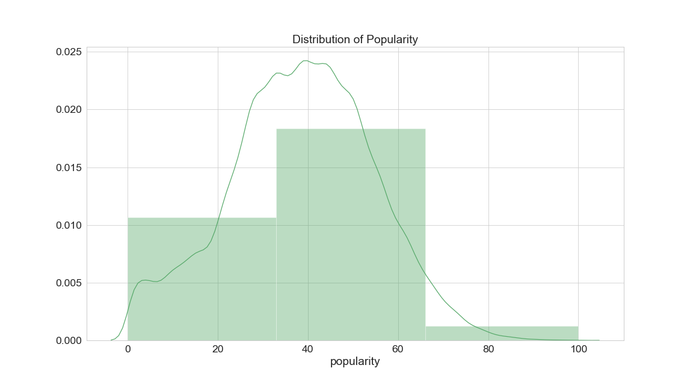
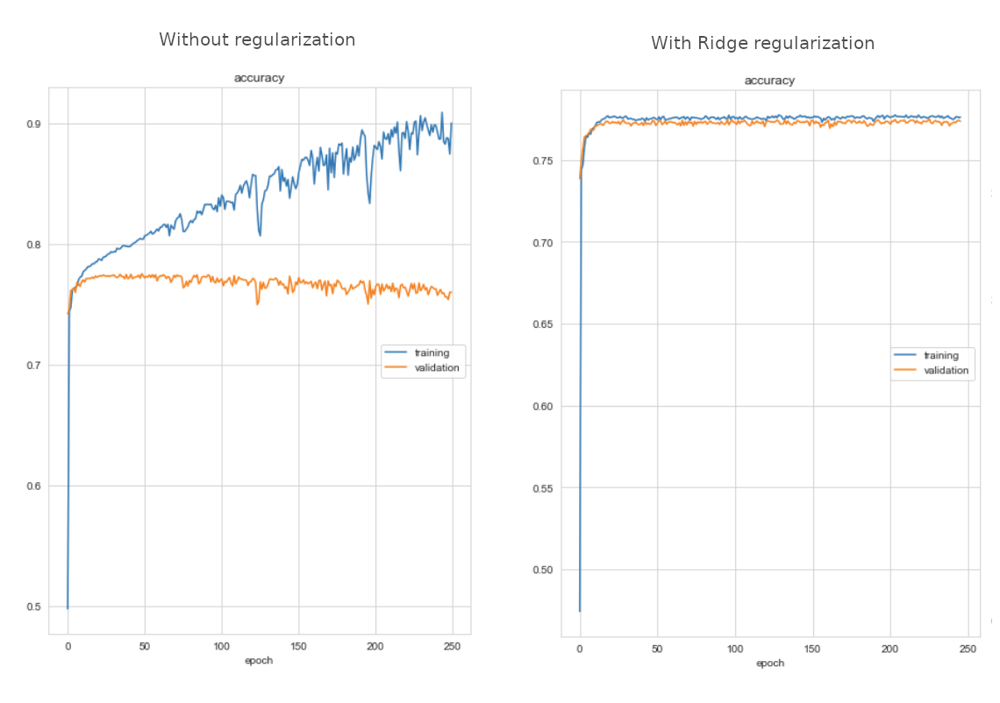
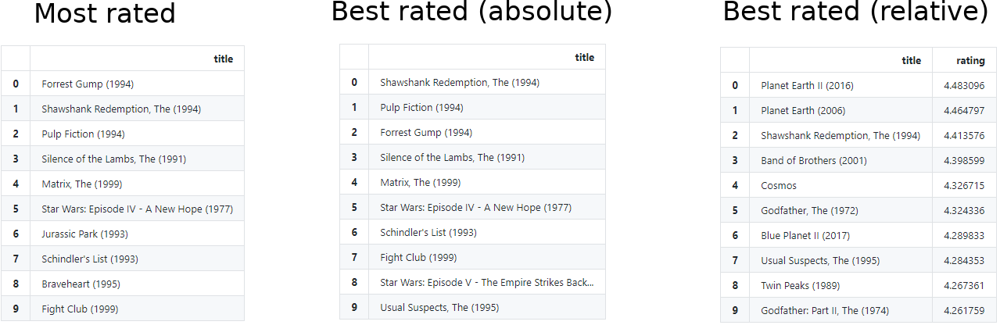

# Data Science Portfolio 2021

##### In the following I want to present some of the projects I did in the last months, give some insight in how I work and elaborate on the results.

### Content:

- [Popmodel - Predicting the popularity of songs on Spotify](#pop)
    + [Technology Stack & Project Set Up](#tech_pop)
    + [The Data](#data_pop)
    + [Models](#models_pop)
      + [Linear Regression](#regression)
      + [Classifcation](#classification)
    + [Outcome](#outcome_pop)
- [YourMovie - Movie recommender website based on content- and collaborative-filtering](#movie)
    + [Technology Stack & Project Set Up](#tech_movie)
    + [The Data](#data_movie)
    + [Candidate Generation](#generation_movie)
    + [Web application](#webapp_movie)
    + [Outcome](#outcome_movie)
  
<br/><br/> 

## Popmodel
### Predicting the popularity of songs on Spotify

<br/><br/> 
### Abstract
For my graduation project at [SPICED Academy](https://www.spiced-academy.com/en/program/data-science) I built an application that pulls song features from the Spotify API
to train different regression and classification models, which were able to predict the popularity of new songs with impressive results.

<br/><br/> 
<a name="tech_pop"></a>
### Technology Stack

Using the Spotipy Python library I was able to access the Spotify API and pull song features and analysis data for 233k songs.
Since the bandwidth of the Spotify API is being throttled down in relation to the amount of requests, the application was running on a AWS EC2 machine for several days, writing the data into a MongoDB database.
After data wrangling and feature engineering I built different regression and classification models with the scikit-learn, XGBoost and Keras libraries.

<br/><br/> 
<a name="data_pop"></a>
### The Data
After creating the dataset and exploring the data I decided to combine my data with an [older dataset](https://www.kaggle.com/zaheenhamidani/ultimate-spotify-tracks-db),
since I was not satisfied with the popularity distribution in the data I pulled.

This is what Spotify says about popularity and how it is calculated: _The popularity of a track is a value between 0 and 100, with 100 being the most popular. The popularity is calculated by an algorithm and is based, in the most part, on the total number of plays the track has had and how recent those plays are.
Generally speaking, songs that are being played a lot now will have a higher popularity than songs that were played a lot in the past._

After dropping duplicates, my final dataset consisted of ~162k songs. Since the data from the Spotify API has no NaN values,
data preparation was mainly extracting valuable information from concatenated strings, one-hot or label encoding categorical features, scaling values and resampling the data to even out the distribution of y values.
I ended up with 63 features as for example `tempo`, `genre`, `time_signature`, `loudness`, `key`, `mode` and other interesting information. Next to intuitive song features like `tempo` or `duration` which are self explanatory, Spotify also provides
more complex song analysis like `acousticness` which is a confidence measure from 0.0 to 1.0 of whether the track is acoustic or `danceability` which describes how suitable a track is for dancing based on a combination of musical elements including tempo,
rhythm stability, beat strength, and overall regularity.


#### Exploratory Data Analysis

The first dataset I generated had almost no songs with a popularity over 10%. When I added the older dataset the popularity was more normally distributed, looking like this:



What still stands out is the peak at a popularity score of zero. I analyzed some samples and it turned out that these songs are often duplicates of more successful  
songs, but released on unpopular song collections. That means the popularity of these songs is in reality somewhere higher than zero. I therefore decided to drop these songs.  
Also we can see that there are almost no songs with a popularity higher than 80%, so it will be problematic for the model predict very popular songs as well as unpopular songs with actual zero popularity.

The three features that turned out to have the highest correlation with popularity are the `pop` genre (obviously as it is "popular music"), `acousticness` and `loudness` as we can see in this matrix of the 10 features that have the highest correlation with popularity:



<br/><br/> 
##### Just for fun I also created a word cloud with the ten thousand most occurring words in the song titles:



<br/><br/> 
<br/><br/> 
<a name="models_pop"></a>
### Models
I built different linear regression and classification models respectively with scikit-learn, XGBoost and Keras to find out the best method to predict the success of a song.


<a name="regression"></a>
#### Linear Regression
As a measure of accuracy to rate the linear models, I chose the root mean squared error (RMSE) since I wanted to put more weight on larger errors / outliers.
I built several linear machine learning models with the scikit-learn and XGBoost libraries and also neural networks with the Keras library to see which one delivers the best results. In the following I want to compare the different results:

- RandomForestRegressor   - RMSE: **7.9**
- XGBRegressor            - RMSE: **8.3**
- Feed Forward Network    - RMSE: **8.5**
- LinearRegression        - RMSE: **9.7**
- Ridge                   - RMSE: **9.7**
- Lasso                   - RMSE: **14.6**

Comparing the results we can see that the RandomForestRegressor is the most accurate linear model. For each machine learning model I initially worked with the standard settings and afterwards used grid search for hyperparameter tuning to find the best individual specifications.
Here we can see the best settings that I found for the RandomForestRegressor. The standard settings were already pretty satisfying and I only had to tweak two parameters by a notch:
```
RandomForestRegressor(min_samples_leaf=2, n_estimators=125, verbose=1, n_jobs=-1)
```

Here the already more complex settings for the XGBRegressor:

```
XGBRegressor(seed=27, colsample_bytree=0.9, subsample=0.8,
             gamma=0.2, min_child_weight=1, max_depth=5, n_estimators=1000, learning_rate =0.3,
             sampling_method="gradient_based", random_state=3, n_jobs=-1, tree_method='gpu_hist',
             predictor= 'gpu_predictor', verbosity=2)
```

In order to find the best set up for the feed forward network (FFN) with Keras I mostly went by trial & error to see what works best.
I ended up with the following structure of an input layer with 8k neurons, two hidden layers with 200 and 20 neurons and a linear output layer.
Tweaking the ADAM optimizer helped to get faster and better results.
```
def build_model():
    model = keras.Sequential([
    Dense(8000, activation='relu', input_shape=(63,)),
    Dense(200, activation="relu"),
    Dense(20, activation="relu"),
    Dense(1, activation="linear")
    ])

    model.compile(loss="mse",
                optimizer=tf.keras.optimizers.Adam(learning_rate=0.006, beta_1=0.8, amsgrad=True),
                metrics=["RootMeanSquaredError", "mae"]
                )
    return model
```

<br/><br/> 
<a name="classification"></a>
#### Classification

In order to predict the popularity in classification models, I decided to bin the values in 3 uniform classes
(_"Not Popular 0-33%", "Popular 33-66%"_ and _"Very Popular 66-100%"_).
As a measure of accuracy to rate the results, I chose the f1 score with a weighted average to account for the resulting class imbalance,
since the popularity of most songs in the dataset is in the _"Popular"_ segment between 33% and 66%.  
I had tried to counteract this imbalance with over- and undersampling, but this let to quite bad results so I decided against it.



Same as with linear regression I built several machine learning models and neural networks to see which one performs the best.
Additionaly I used the imblearn library which provides classifier models and sampling tools exclusively for class imbalanced learning. Let's have a look at the different models and their results:

- XGBClassifier                  - F1: **0.80**
- Feed Forward Network           - F1: **0.78**
- RandomForestClassifier         - F1: **0.78**
- BaggingClassifier              - F1: **0.78**
- BalancedBaggingClassifier      - F1: **0.75**
- BalancedRandomForestClassifier - F1: **0.73**
- XGBRFClassifier                - F1: **0.73**

Also in classification the machine learning models perform better than the neural networks in this dataset.
The XGBClassifier from the XGBoost library provides the best accuracy at a f1 score of 80% with following settings:

```
XGBClassifier(seed=27, objective='multi:softprob', colsample_bytree=0.8, subsample=0.5,
                       gamma=0, min_child_weight=1, max_depth=10, n_estimators=1000, learning_rate =0.1,
                       sampling_method="gradient_based", random_state=3, n_jobs=-1, tree_method='gpu_hist',
                       predictor= 'gpu_predictor', verbosity=3)
```

The FFN is slightly less accurate but still achieves a f1 score of 78% and is set up with an input layer with 4000 neurons,
an hidden layer with 100 neurons and an outputlayer with a softmax activation to predict the probabilites of the three classes:

```
def build_model2():
  model = Sequential([

    Dense(4000, activation='relu', input_shape=(63,),
    kernel_regularizer= keras.regularizers.l2(0.005),
    bias_regularizer=keras.regularizers.l2(0.005),
    activity_regularizer=keras.regularizers.l2(0.005)
    ),

    Dense(100, activation='relu',
    kernel_regularizer= keras.regularizers.l2(0.005),
    bias_regularizer=keras.regularizers.l2(0.005),
    activity_regularizer=keras.regularizers.l2(0.005)
    ),

    Dense(3, activation='softmax',
    kernel_regularizer= keras.regularizers.l2(0.005),
    bias_regularizer=keras.regularizers.l2(0.005),
    activity_regularizer=keras.regularizers.l2(0.005)
    ),
  ])

  model.compile(loss="categorical_crossentropy",
                optimizer="adam",
                metrics=["accuracy"])
  return model
```

Adding Ridge regularization as a penalty term was neccessary to prevent the model from massively overfitting,
as we can see here in the comparison between compiling with and without regularization:



<br/><br/> 
<a name="outcome_pop"></a>
### Outcome

I actually didn't expect the results of this project to be that positive,
since I thought the immeasurable emotional factor of music is the biggest influence that determines its popularity.
In my opinion the linear regression is the best model for this, since it provides a more accurate and relatable estimation of the popularity compared to the classification approach.
Even if it looks like the model is working great, it would be interesting to see how it works with another dataset, since I had to remove all songs with zero popularity and there are only few very popular samples.

<br/><br/>
<br/><br/> 
<a name="movie"></a>
## YourMovie

#### Movie recommender website based on content based- and collaborative-filtering

[your-movie.heroku.com](https://your-movie.herokuapp.com/)

### Abstract
I created a [website](https://your-movie.herokuapp.com/) running on Flask/Heroku where users can insert their favorite movies and get recommendations related to their specific taste.
The results are calculated by a weighted combination of content based- and collaborative filtering using the [MovieLens](https://grouplens.org/datasets/movielens/) database consisting of 25 million user ratings and metadata.

<br/><br/> 
<a name="tech_movie"></a>
### Technology Stack


After data wrangling in Pandas I computed two matrices for content- and collaborative filtering and exported them as binary pickle files so the application won't have to re-calculate
the matrices every time again. To achieve better results I used a weighted combination of different similarity measures as cosine similarity from the sklearn library and the dot product from numpy.
I used Twitter's bootstrap CSS framework to set up a basic website while the recommender system is running on Flask, a micro web framework.
Finally I'm running the application on Heroku, a cloud platform service, so the recommender is accessible from the www.

<br/><br/> 
<a name="data_movie"></a>
### The Data

For this project I utilized the newest dataset from [Movielens](https://grouplens.org/datasets/movielens/25m/) consisting of
25 million movie ratings and one million tag applications applied to 62,000 movies by 162,000 users.


<br/><br/> 

I used the data from the ratings table for collaborative filtering to create a user-item matrix.
Even with 32GB of RAM my computer reached its limit when I tried to create the collaborative matrix for all 25 million ratings.
I decided to filter out movies that received only ten or fewer ratings and ended up with 24 million ratings that resulted in a 
still pretty large collaborative matrix of 13,183 rows (movies) and 162,541 columns (users). After filtering still 100%
of the users were kept but only 22% of the initial amount of movies.

I found it quite interesting to see which movies were the most successful ones in this dataset, since I know the IMDb Top 10 movies by heart.
One of the first things that I looked at when I opened the dataset were the following views. First column are the movies that got the most user ratings overall,
no matter how good or how bad the rating was. In the second column all user ratings are cumulated for each movie, meaning they have the most and the highest ratings.
The last column is the most honest in my opinion. Here I divided the cumulated ratings by the amount of ratings, so less popular but high rated movies are also showing up.
I only included movies that received more than 150 ratings to dismiss movies that got very high ratings from very few or single users.

<br/><br/> 


<br/><br/> 
<a name="generation_movie"></a>
### Candidate Generation
As I already mentioned I created this recommender system by combining two different filter methods, content based- and collaborative filtering and generating the final candidates for the recommendation by combining different similarity measures.
<br/><br/> 
##### Content-based filtering
To find similarities between items for content-based filtering I combined the genres with the metadata from the tags column all in one column and transformed
the strings into vectors by using tf-idf transformer from the sklearn library. Since this step of engineering leads to a huge size of each single vector, this would slow down the recommending
process a lot. Therefore, I reduced the dimensionality of the vectors with truncated singular value decomposition (SVD) and chose 4000 components to describe each movie, which was a good compromise
between loss of information and performance.
<br/><br/> 
##### Collaborative filtering
Here I want to find similarities between users and items simultaneously using the explicit user-generated ratings. I included only the movies that I also used for content-based filtering which gave me
roughly 24 million ratings for 162.000 movies from 13.000 different users. Therefore, the size of the sparse rating matrix R was 13.000 rows (users) and 162.000 columns (movies). 
I filled the missing ratings with zeros and performed a non-negative matrix factorization (NMF) with 60 components on the matrix for dimensionality reduction.
<br/><br/> 
#### Similarity Measures
After I created these two different embeddings for any user / movie pairing I had to choose similarity measures that take these embeddings and return a number measuring their similarity.
For both filtering methods I used a combination of two different similarity measures, the dot product and the cosine similarity. Although these two are quite similar, they differ in their behavior since
cosine similarity is only looking at the angle between vectors while the dot product is also taking the length of a vector into account. Movies that appear very often in the ratings result in a larger vector length,
so the dot similarity captures especially popular movies while the cosine similarity treats them more equal to less popular items. By combining these two measures I found my personal sweet spot to receive great recommendations.
<br/><br/> 
#### Weighted combination of both filtering methods
Both filtering methods work already great by themselves and produce valuable recommendations, but while testing I saw that in different cases one method provides better results than the other.
I decided to scale the results of both filtering methods so I could compare them, rank them equally and combine the results. Even better results I eventually got, when I set the weight on collaborative filtering to only 40% compared to its content-based counterpart.

<br/><br/> 
<a name="webapp_movie"></a>
### Web Implementation
Creating and explaining this recommender is one thing, but to be able to let others trying it out was something I definitely wanted to achieve aswell. To make this possible I needed a website, a webfamework where my recommender system could run on and a platform to host this framework.

For the website I used the open-source HTML/CSS framework from Twitter called _Bootstrap_, since this is a quick way to create the front end of a website. The website aswell as the python code for the recommender is running on _Flask_ which creates a local web application. This webapp I'm hosting on _Heroku_,
a cloud-based platform as a service to be able to access the website online.


<br/><br/>
<a name="out_movie"></a>
### Outcome
If you want to try my recommender yourself go to [your-movie.herokuapp.com](https://your-movie.herokuapp.com/) and find movies that fit your taste. Rating the performance of recommender systems is obviously very subjective and only by trying out you will eventually see
if you chose the right methods to produce the recommendations. In this case I'm very happy with the results and I could actually already find movies that I didn't know before and enjoyed a lot. 


.

.

.

.

.

.

.
.

.

.

.

.

.


You can use the [editor on GitHub](https://github.com/Basmatz/Portfolio_2020/edit/main/README.md) to maintain and preview the content for your website in Markdown files.

Whenever you commit to this repository, GitHub Pages will run [Jekyll](https://jekyllrb.com/) to rebuild the pages in your site, from the content in your Markdown files.

### Markdown

Markdown is a lightweight and easy-to-use syntax for styling your writing. It includes conventions for

```markdown
Syntax highlighted code block

# Header 1
## Header 2
### Header 3

- Bulleted
- List

1. Numbered
2. List

**Bold** and _Italic_ and `Code` text

[Link](url) and 
```

For more details see [GitHub Flavored Markdown](https://guides.github.com/features/mastering-markdown/).

### Jekyll Themes

Your Pages site will use the layout and styles from the Jekyll theme you have selected in your [repository settings](https://github.com/Basmatz/Portfolio_2020/settings). The name of this theme is saved in the Jekyll `_config.yml` configuration file.

### Support or Contact

Having trouble with Pages? Check out our [documentation](https://docs.github.com/categories/github-pages-basics/) or [contact support](https://github.com/contact) and we’ll help you sort it out.
