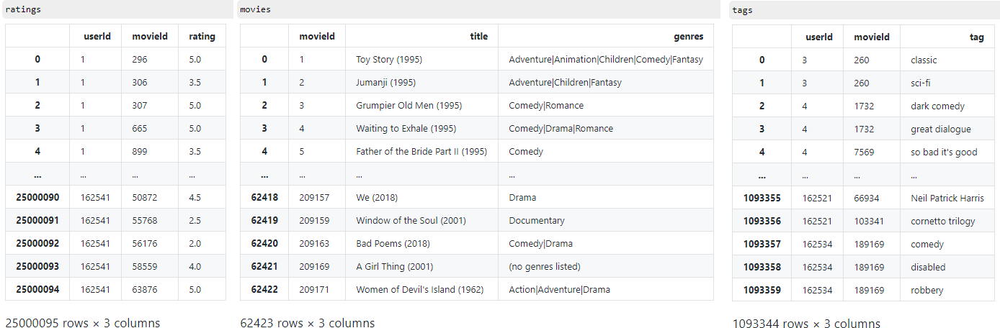
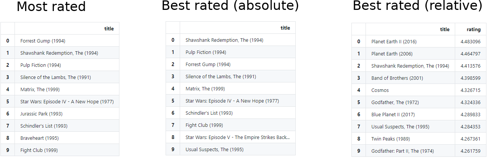

    
## YourMovie

#### Movie recommender website based on content- and collaborative filtering

Try it out yourself: [your-movie.herokuapp.com](https://your-movie.herokuapp.com/)

### Content:

- [YourMovie - An online movie recommender system](#movie)
    + [Technology Stack & Project Set Up](#tech_movie)
    + [The Data](#data_movie)
    + [Candidate Generation](#generation_movie)
    + [Web application](#webapp_movie)
    + [Outcome](#outcome_movie)

### Abstract
I created a [website](https://your-movie.herokuapp.com/) running on Flask/Heroku where users can insert their favorite movies and get recommendations related to their specific taste.
The results are calculated by a weighted combination of content based- and collaborative filtering using the [MovieLens](https://grouplens.org/datasets/movielens/) database consisting of 25 million user ratings and metadata.

   

### Technology Stack

After data wrangling & feature engineering in Pandas I computed two matrices for content-based and collaborative filtering and exported them as binary pickle files so the application won't have to re-calculate
the matrices every time again. To achieve better results I used a weighted combination of different similarity measures as cosine similarity from the sklearn library and the dot product from numpy.
I used Twitter's bootstrap CSS framework to set up a basic website while the recommender system is running on Flask, a micro web framework.
Finally I'm running the application on Heroku, a cloud platform service, so the recommender is accessible from the www.

   

### The Data

For this project I utilized the newest dataset from [Movielens](https://grouplens.org/datasets/movielens/25m/) consisting of
25 million movie ratings and one million tag applications applied to 62,000 movies by 162,000 users.

   

I used the data from the ratings table for collaborative filtering to create a user-item matrix.
Even with 32GB of RAM my computer reached its limit when I tried to create the collaborative matrix for all 25 million ratings.
I decided to filter out movies that received only ten or fewer ratings and ended up with 24 million ratings that resulted in a 
still pretty large collaborative matrix of 13,183 rows (movies) and 162,541 columns (users). After filtering still 100%
of the users were kept but only 22% of the initial amount of movies.

I found it quite interesting to see which movies were the most successful ones in this dataset, since I know the IMDb Top 10 movies by heart.
One of the first things that I looked at when I opened the dataset were the following views. First column are the movies that got the most user ratings overall,
no matter how good or how bad the rating was. In the second column all user ratings are cumulated for each movie, meaning they have the most and the highest ratings.
The last column is the most honest in my opinion. Here I divided the cumulated ratings by the amount of ratings, so less popular but high rated movies are also showing up.
I only included movies that received more than 150 ratings to dismiss movies that got very high ratings from very few or single users.

   

   

### Candidate Generation
As I already mentioned I created this recommender system by combining two different filter methods, content based- and collaborative filtering and generating the final candidates for the recommendation by combining different similarity measures.
   
##### Content-based filtering
To find similarities between items for content-based filtering I combined the genres with the metadata from the tags column all in one column and transformed
the strings into vectors by using tf-idf transformer from the sklearn library. Since this step of engineering leads to a huge size of each single vector, this would slow down the recommending
process a lot. Therefore, I reduced the dimensionality of the vectors with truncated singular value decomposition (SVD) and chose 4000 components to describe each movie, which was a good compromise
between loss of information and performance.
   
##### Collaborative filtering
Here I want to find similarities between users and items simultaneously using the explicit user-generated ratings. I included only the movies that I also used for content-based filtering which gave me
roughly 24 million ratings for 162.000 movies from 13.000 different users. Therefore, the size of the sparse rating matrix R was 13.000 rows (users) and 162.000 columns (movies). 
I filled the missing ratings with zeros and performed a non-negative matrix factorization (NMF) with 60 components on the matrix for dimensionality reduction.
   
#### Similarity Measures
After I created these two different embeddings for any user / movie pairing I had to choose similarity measures that take these embeddings and return a number measuring their similarity.
For both filtering methods I used a combination of two different similarity measures, the dot product and the cosine similarity. Although these two are quite similar, they differ in their behavior since
cosine similarity is only looking at the angle between vectors while the dot product is also taking the length of a vector into account. Movies that appear very often in the ratings result in a larger vector length,
so the dot similarity captures especially popular movies while the cosine similarity treats them more equal to less popular items. By combining these two measures I found my personal sweet spot to receive great recommendations.
   
#### Weighted combination of both filtering methods
Both filtering methods work already great by themselves and produce valuable recommendations, but while testing I saw that in different cases one method provides better results than the other.
I decided to scale the results of both filtering methods so I could compare them, rank them equally and combine the results. Even better results I eventually got, when I set the weight on collaborative filtering to only 40% compared to its content-based counterpart.

   

### Web Application
Creating and explaining this recommender is one thing, but to be able to let others trying it out was something I definitely wanted to achieve aswell. Very crucial to get this working, I had to export the final matrices as binary files so I didn't had to re-run the whole code which takes an hour to complete.
I exported the calculated matrices with the pickle library so I can skip this step from now on. To make the application interactive I needed a website, a webfamework where my recommender system could run on and a platform to host this framework.

For the website I used the open-source HTML/CSS framework from Twitter called [Bootstrap](https://getbootstrap.com/), since this is a quick way to create the front end of a website. The website aswell as the python code for the recommender is running on [Flask](https://flask.palletsprojects.com/en/1.1.x/) which creates a local web application. This webapp I'm hosting on [Heroku](https://www.heroku.com/home),
a cloud-based platform as a service to be able to access the website online.

Try it out yourself: [your-movie.herokuapp.com](https://your-movie.herokuapp.com/)
  

### Outcome
If you want to try my recommender yourself go to [your-movie.herokuapp.com](https://your-movie.herokuapp.com/) and find movies that fit your taste. Rating the performance of recommender systems is obviously very subjective and only by trying out you will eventually see
if you chose the right methods to produce the recommendations. In this case I'm very happy with the results and I could actually already find movies that I didn't know before and enjoyed a lot.