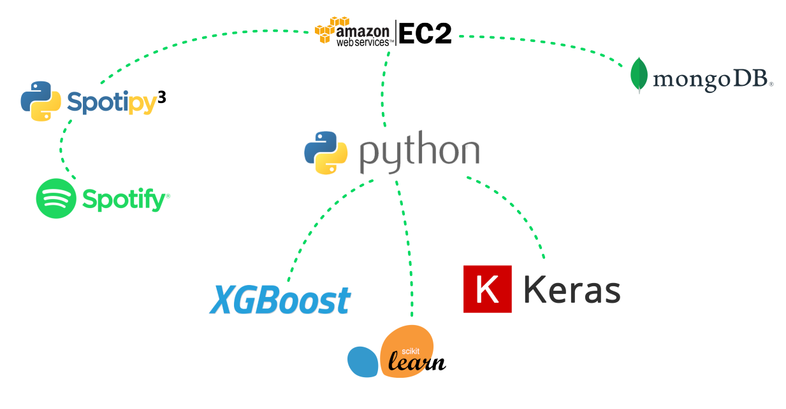
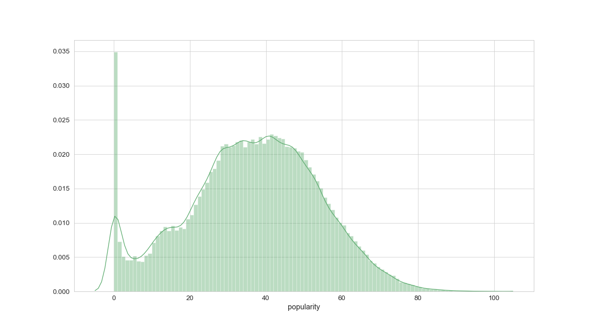
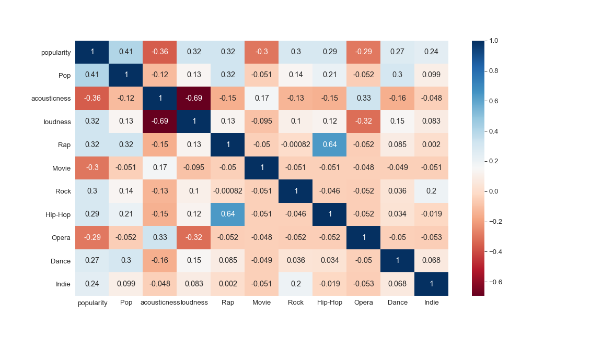
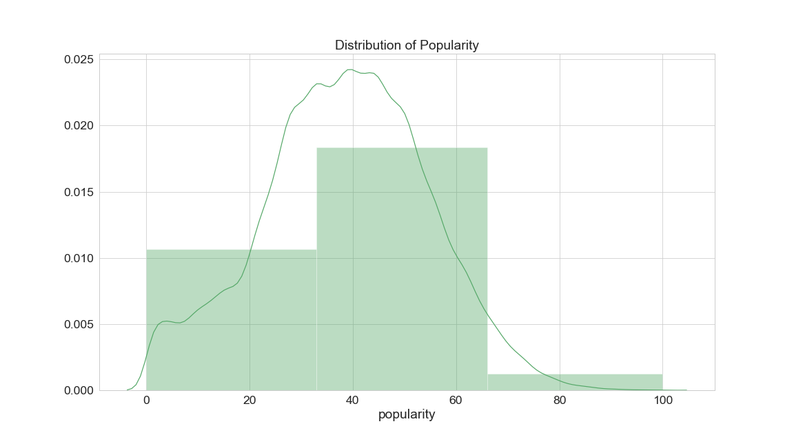
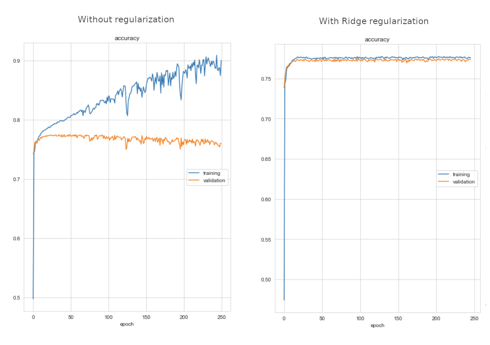

    
## Popmodel
#### Predicting the popularity of songs on Spotify

### Content:

- [Popmodel - Predicting the popularity of songs on Spotify](#pop)
    + [Technology Stack & Project Set Up](#tech_pop)
    + [The Data](#data_pop)
    + [Models](#models_pop)
      + [Linear Regression](#regression)
      + [Classifcation](#classification)
    + [Outcome](#outcome_pop)

### Abstract
For my graduation project at [SPICED Academy](https://www.spiced-academy.com/en/program/data-science) I built an application that pulls song features from the Spotify API
to train different regression and classification models, which were able to predict the popularity of new songs with impressive results.

<br/><br/> 
<a name="tech_pop"></a>
### Technology Stack

Using the Spotipy Python library I was able to access the Spotify API and pull song features and analysis data for 233k songs.
Since the bandwidth of the Spotify API is being throttled down in relation to the amount of requests, the application was running on a AWS EC2 machine for several days, writing the data into a MongoDB database.
After data wrangling and feature engineering I built different regression and classification models with the scikit-learn, XGBoost and Keras libraries.

<br/><br/> 
<a name="data_pop"></a>
### The Data
After creating the dataset and exploring the data I decided to combine my data with an [older dataset](https://www.kaggle.com/zaheenhamidani/ultimate-spotify-tracks-db),
since I was not satisfied with the popularity distribution in the data I pulled.

This is what Spotify says about popularity and how it is calculated: _The popularity of a track is a value between 0 and 100, with 100 being the most popular. The popularity is calculated by an algorithm and is based, in the most part, on the total number of plays the track has had and how recent those plays are.
Generally speaking, songs that are being played a lot now will have a higher popularity than songs that were played a lot in the past._

After dropping duplicates, my final dataset consisted of ~162k songs. Since the data from the Spotify API has no NaN values,
data preparation was mainly extracting valuable information from concatenated strings, one-hot or label encoding categorical features, scaling values and resampling the data to even out the distribution of y values.
I ended up with 63 features as for example `tempo`, `genre`, `time_signature`, `loudness`, `key`, `mode` and other interesting information. Next to intuitive song features like `tempo` or `duration` which are self explanatory, Spotify also provides
more complex song analysis like `acousticness` which is a confidence measure from 0.0 to 1.0 of whether the track is acoustic or `danceability` which describes how suitable a track is for dancing based on a combination of musical elements including tempo,
rhythm stability, beat strength, and overall regularity.


#### Exploratory Data Analysis

The first dataset I generated had almost no songs with a popularity over 10%. When I added the older dataset the popularity was more normally distributed, looking like this:



What still stands out is the peak at a popularity score of zero. I analyzed some samples and it turned out that these songs are often duplicates of more successful  
songs, but released on unpopular song collections. That means the popularity of these songs is in reality somewhere higher than zero. I therefore decided to drop these songs.  
Also we can see that there are almost no songs with a popularity higher than 80%, so it will be problematic for the model predict very popular songs as well as unpopular songs with actual zero popularity.

The three features that turned out to have the highest correlation with popularity are the `pop` genre (obviously as it is "popular music"), `acousticness` and `loudness` as we can see in this matrix of the 10 features that have the highest correlation with popularity:



<br/><br/> 
##### Just for fun I also created a word cloud with the ten thousand most occurring words in the song titles:


<br/><br/> 
<br/><br/> 
<a name="models_pop"></a>
### Models
I built different linear regression and classification models respectively with scikit-learn, XGBoost and Keras to find out the best method to predict the success of a song.


<a name="regression"></a>
#### Linear Regression
As a measure of accuracy to rate the linear models, I chose the root mean squared error (RMSE) since I wanted to put more weight on larger errors / outliers.
I built several linear machine learning models with the scikit-learn and XGBoost libraries and also neural networks with the Keras library to see which one delivers the best results. In the following I want to compare the different results:

- RandomForestRegressor   - RMSE: **7.9**
- XGBRegressor            - RMSE: **8.3**
- Feed Forward Network    - RMSE: **8.5**
- LinearRegression        - RMSE: **9.7**
- Ridge                   - RMSE: **9.7**
- Lasso                   - RMSE: **14.6**

Comparing the results we can see that the RandomForestRegressor is the most accurate linear model. For each machine learning model I initially worked with the standard settings and afterwards used grid search for hyperparameter tuning to find the best individual specifications.
Here we can see the best settings that I found for the RandomForestRegressor. The standard settings were already pretty satisfying and I only had to tweak two parameters by a notch:
```
RandomForestRegressor(min_samples_leaf=2, n_estimators=125, verbose=1, n_jobs=-1)
```

Here the already more complex settings for the XGBRegressor:

```
XGBRegressor(seed=27, colsample_bytree=0.9, subsample=0.8,
             gamma=0.2, min_child_weight=1, max_depth=5, n_estimators=1000, learning_rate =0.3,
             sampling_method="gradient_based", random_state=3, n_jobs=-1, tree_method='gpu_hist',
             predictor= 'gpu_predictor', verbosity=2)
```

In order to find the best set up for the feed forward network (FFN) with Keras I mostly went by trial & error to see what works best.
I ended up with the following structure of an input layer with 8k neurons, two hidden layers with 200 and 20 neurons and a linear output layer.
Tweaking the ADAM optimizer helped to get faster and better results.
```
def build_model():
    model = keras.Sequential([
    Dense(8000, activation='relu', input_shape=(63,)),
    Dense(200, activation="relu"),
    Dense(20, activation="relu"),
    Dense(1, activation="linear")
    ])

    model.compile(loss="mse",
                optimizer=tf.keras.optimizers.Adam(learning_rate=0.006, beta_1=0.8, amsgrad=True),
                metrics=["RootMeanSquaredError", "mae"]
                )
    return model
```

<br/><br/> 
<a name="classification"></a>
#### Classification

In order to predict the popularity in classification models, I decided to bin the values in 3 uniform classes
(_"Not Popular 0-33%", "Popular 33-66%"_ and _"Very Popular 66-100%"_).
As a measure of accuracy to rate the results, I chose the f1 score with a weighted average to account for the resulting class imbalance,
since the popularity of most songs in the dataset is in the _"Popular"_ segment between 33% and 66%.  
I had tried to counteract this imbalance with over- and undersampling, but this let to quite bad results so I decided against it.



Same as with linear regression I built several machine learning models and neural networks to see which one performs the best.
Additionaly I used the imblearn library which provides classifier models and sampling tools exclusively for class imbalanced learning. Let's have a look at the different models and their results:

- XGBClassifier                  - F1: **0.80**
- Feed Forward Network           - F1: **0.78**
- RandomForestClassifier         - F1: **0.78**
- BaggingClassifier              - F1: **0.78**
- BalancedBaggingClassifier      - F1: **0.75**
- BalancedRandomForestClassifier - F1: **0.73**
- XGBRFClassifier                - F1: **0.73**

Also in classification the machine learning models perform better than the neural networks in this dataset.
The XGBClassifier from the XGBoost library provides the best accuracy at a f1 score of 80% with following settings:

```
XGBClassifier(seed=27, objective='multi:softprob', colsample_bytree=0.8, subsample=0.5,
                       gamma=0, min_child_weight=1, max_depth=10, n_estimators=1000, learning_rate =0.1,
                       sampling_method="gradient_based", random_state=3, n_jobs=-1, tree_method='gpu_hist',
                       predictor= 'gpu_predictor', verbosity=3)
```

The FFN is slightly less accurate but still achieves a f1 score of 78% and is set up with an input layer with 4000 neurons,
an hidden layer with 100 neurons and an outputlayer with a softmax activation to predict the probabilites of the three classes:

```
def build_model2():
  model = Sequential([

    Dense(4000, activation='relu', input_shape=(63,),
    kernel_regularizer= keras.regularizers.l2(0.005),
    bias_regularizer=keras.regularizers.l2(0.005),
    activity_regularizer=keras.regularizers.l2(0.005)
    ),

    Dense(100, activation='relu',
    kernel_regularizer= keras.regularizers.l2(0.005),
    bias_regularizer=keras.regularizers.l2(0.005),
    activity_regularizer=keras.regularizers.l2(0.005)
    ),

    Dense(3, activation='softmax',
    kernel_regularizer= keras.regularizers.l2(0.005),
    bias_regularizer=keras.regularizers.l2(0.005),
    activity_regularizer=keras.regularizers.l2(0.005)
    ),
  ])

  model.compile(loss="categorical_crossentropy",
                optimizer="adam",
                metrics=["accuracy"])
  return model
```

Adding Ridge regularization as a penalty term was neccessary to prevent the model from massively overfitting,
as we can see here in the comparison between compiling with and without regularization:



<br/><br/> 
<a name="outcome_pop"></a>
### Outcome

I actually didn't expect the results of this project to be that positive,
since I thought the immeasurable emotional factor of music is the biggest influence that determines its popularity.
In my opinion the linear regression is the best model for this, since it provides a more accurate and relatable estimation of the popularity compared to the classification approach.
Even if it looks like the model is working great, it would be interesting to see how it works with another dataset, since I had to remove all songs with zero popularity and there are only few very popular samples.